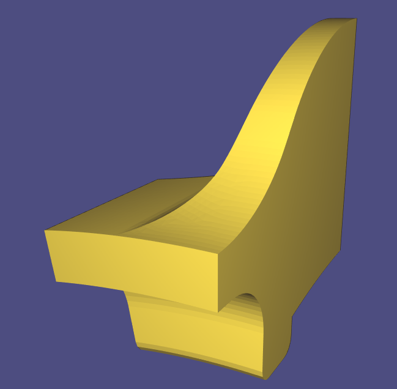
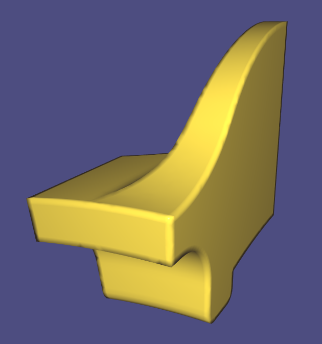
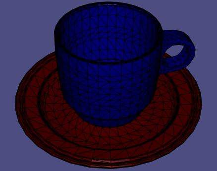
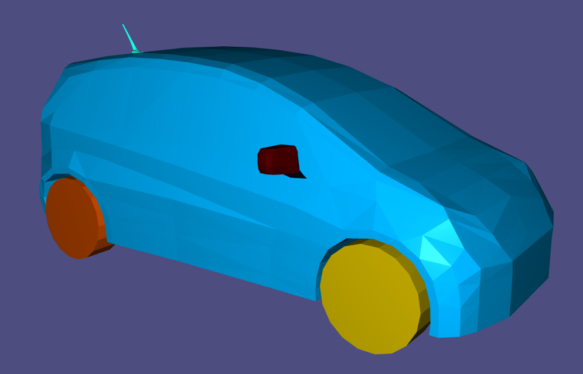
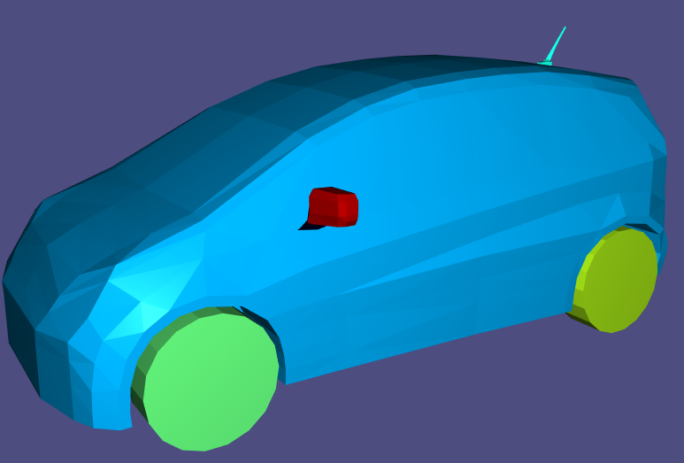
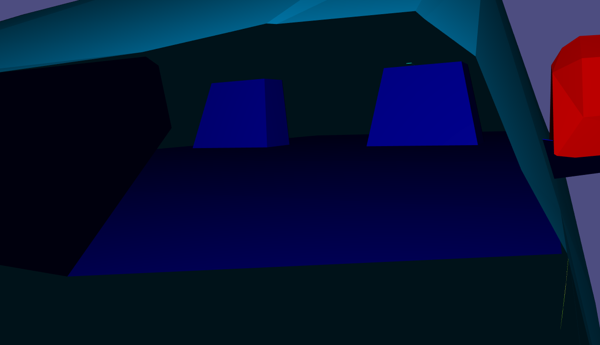
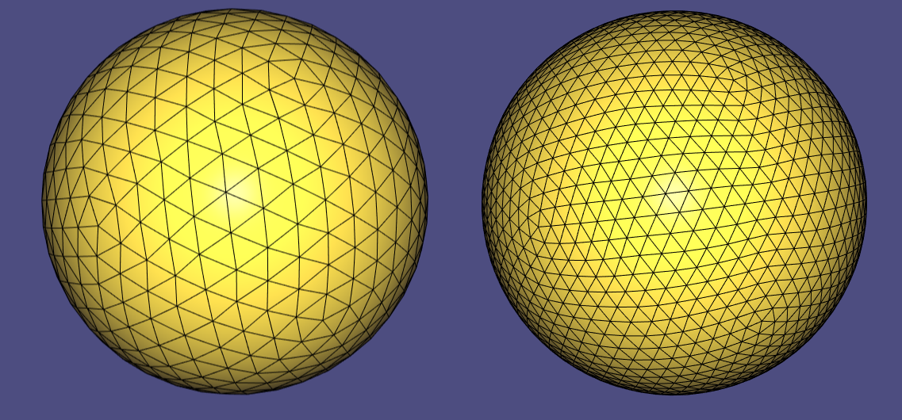
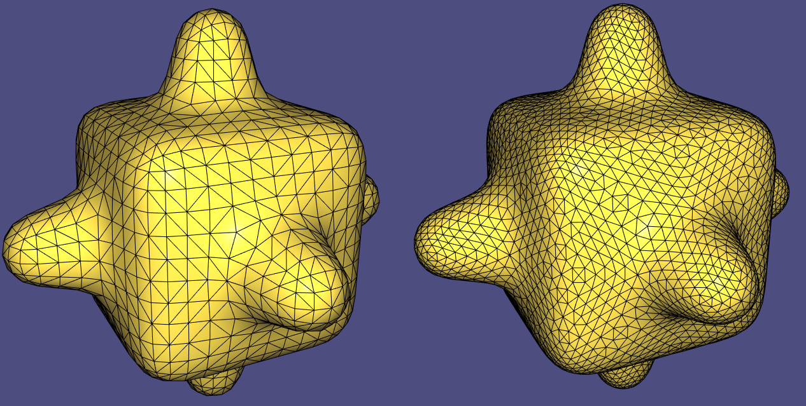
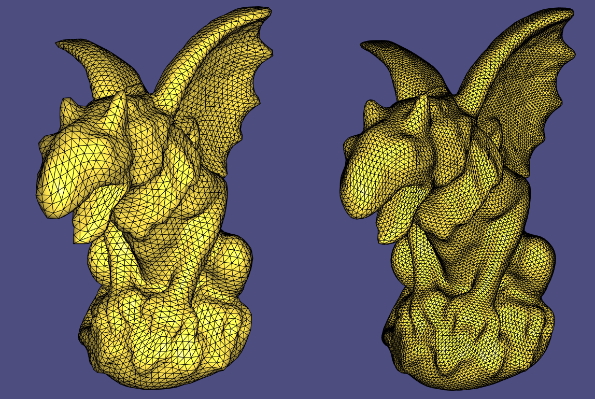
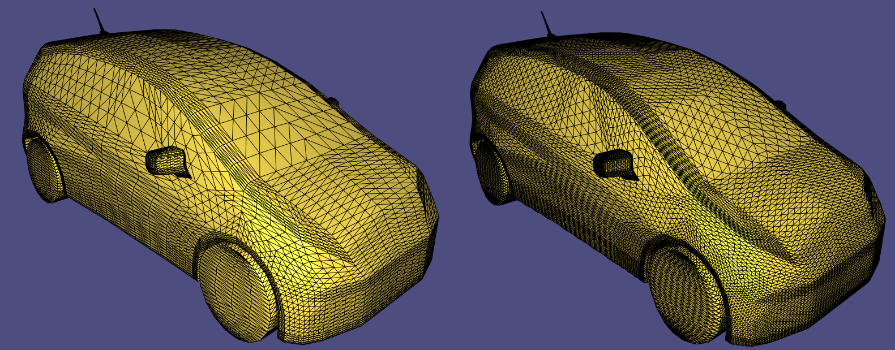

# Assignment 1

Edit this 'README.md' file to report all your results. There is no need to write lengthy reports, just show the requested outputs and screenshots and quickly summarize your observations.   

## Required results

### Tasks
1) Add a text dump of the content of the two data structures for the provided mesh “plane.off”.

vertex id | id of faces
----------| -----------
0 | 5 21 
1 | 31 
2 | 10 26 
3 | 0 
4 | 14 27 30 
5 | 13 23 29 
6 | 1 4 17 
7 | 2 8 18 
8 | 6 9 12 19 22 25 
9 | 15 30 31 
10 | 11 26 27 
11 | 7 21 23 
12 | 15 29 31 
13 | 4 5 20 
14 | 0 1 16 
15 | 8 10 24 
16 | 0 2 16 
17 | 3 8 9 18 19 24 
18 | 3 4 6 17 19 20 
19 | 7 12 13 22 23 28 
20 | 11 12 14 25 27 28 
21 | 1 2 3 16 17 18 
22 | 5 6 7 20 21 22 
23 | 9 10 11 24 25 26 
24 | 13 14 15 28 29 30 

vertex id | vertex neighbour ids
--------- | --------------------
0 | 11 13 22 
1 | 9 12 
2 | 10 15 23 
3 | 14 16 
4 | 9 10 20 24 
5 | 11 12 19 24 
6 | 13 14 18 21 
7 | 15 16 17 21 
8 | 17 18 19 20 22 23 
9 | 1 4 12 24 
10 | 2 4 20 23 
11 | 0 5 19 22 
12 | 1 5 9 24 
13 | 0 6 18 22 
14 | 3 6 16 21 
15 | 2 7 17 23 
16 | 3 7 14 21 
17 | 7 8 15 18 21 23 
18 | 6 8 13 17 21 22 
19 | 5 8 11 20 22 24 
20 | 4 8 10 19 23 24 
21 | 6 7 14 16 17 18 
22 | 0 8 11 13 18 19 
23 | 2 8 10 15 17 20 
24 | 4 5 9 12 19 20 

2) Show three screenshots of the 'fandisk.off' model using 'per-face shading', 'per-vertex shading' and 'per-corner shading'.

#### per-face shading

#### per-vertex shading

#### per-corner shading (60 degree)

3) Show screenshots of the provided meshes with each connected component colored differently. Show the number of connected components and the size of each component (measured in number
of faces) for all the provided models.
#### Coffeecup

Total components: 2
Component ID | Number of faces
------------ | ---------------
0 | 3360
1 | 2304
#### Honda
The holder of the rear mirrors are its own components.

One component is the seats inside the vehicle

Total components: 11
Component ID | Number of faces
------------ | ---------------
0 | 90
1 | 192
2 | 192
3 | 13216
4 | 704
5 | 1088
6 | 1088
7 | 1088
8 | 1088
9 | 736
10 | 736

I only list the tables for the remaining meshes.
#### Bumpy Cube
Total components: 1
Component ID | Number of faces
------------ | ---------------
0 | 2496
#### Bunny
Total components: 1
Component ID | Number of faces
------------ | ---------------
0 | 27864
#### Cube
Total components: 1
Component ID | Number of faces
------------ | ---------------
0 | 3072
#### Fandisk
Total components: 1
Component ID | Number of faces
------------ | ---------------
0 | 12946
#### Gargo
Total components: 1
Component ID | Number of faces
------------ | ---------------
0 | 13500
#### Plane
Total components: 1
Component ID | Number of faces
------------ | ---------------
0 | 32
#### Sphere_lo_norm
Total components: 1
Component ID | Number of faces
------------ | ---------------
0 | 1280
4) Show screenshots of the subdivided meshes.

#### Sphere

#### Bumpy Cube

#### Gargo

#### Honda

