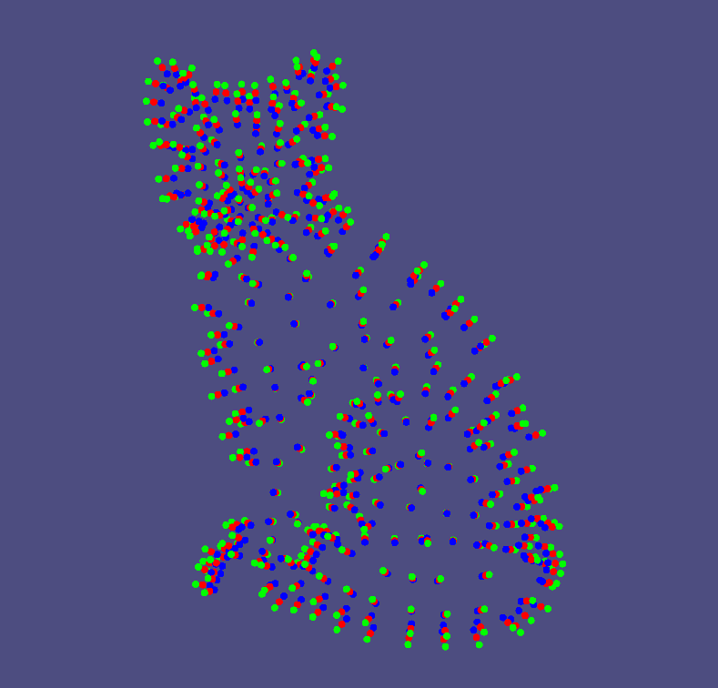
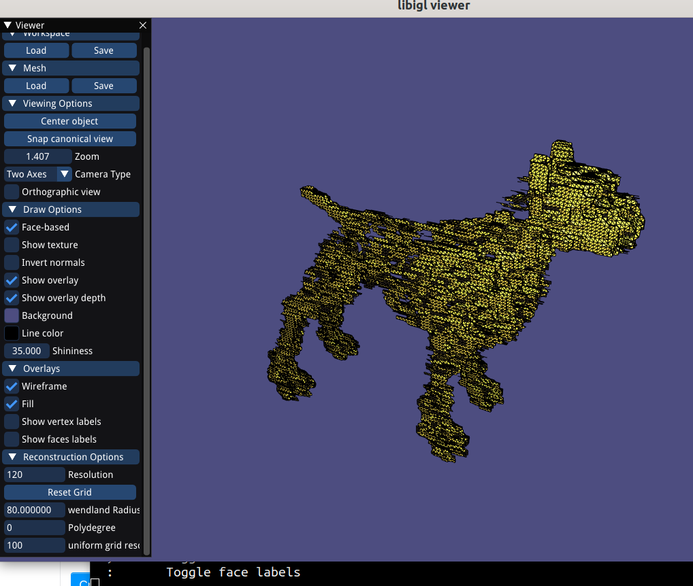
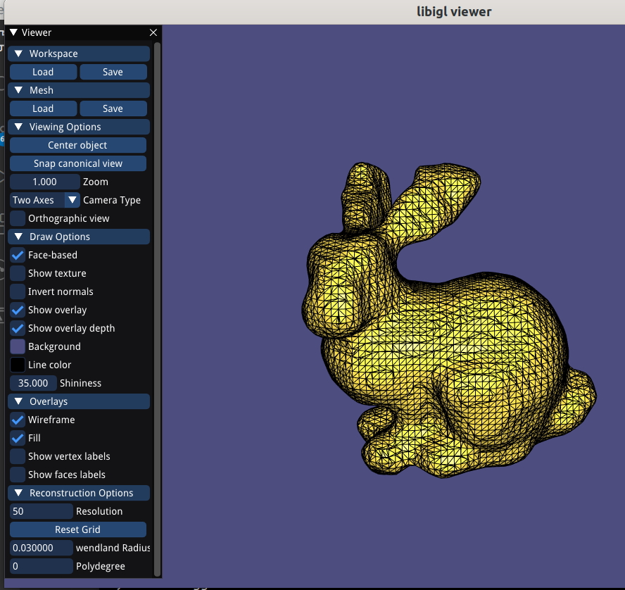
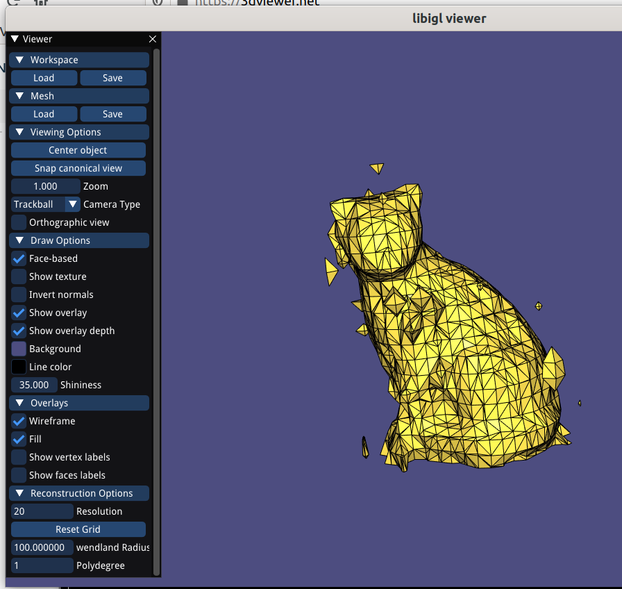
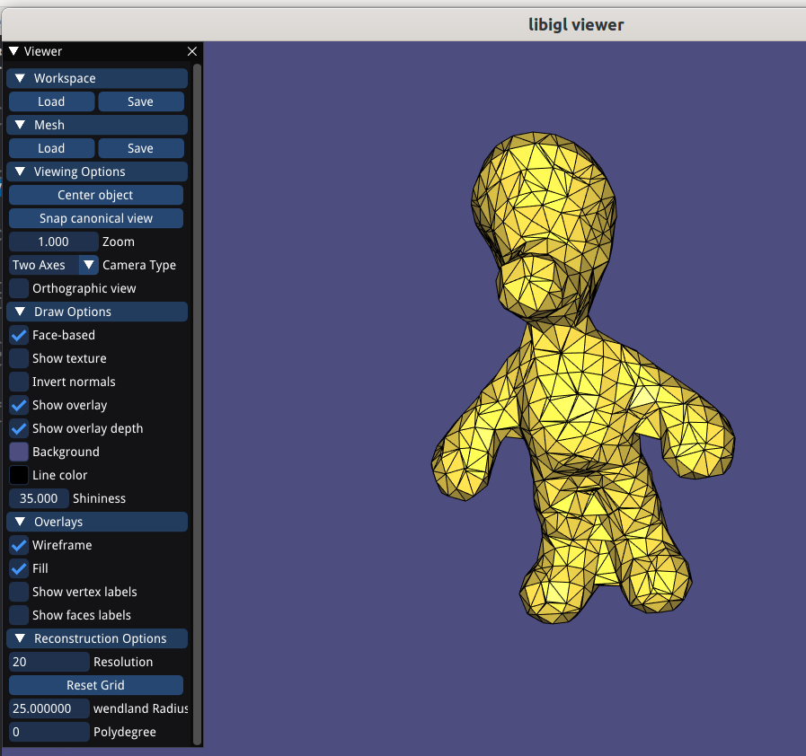
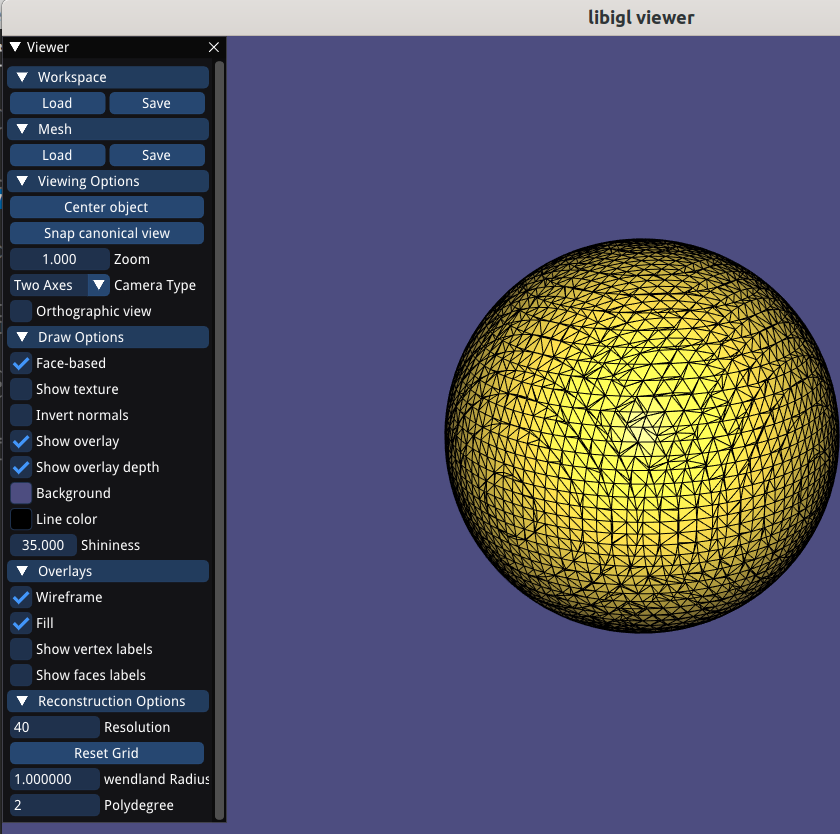
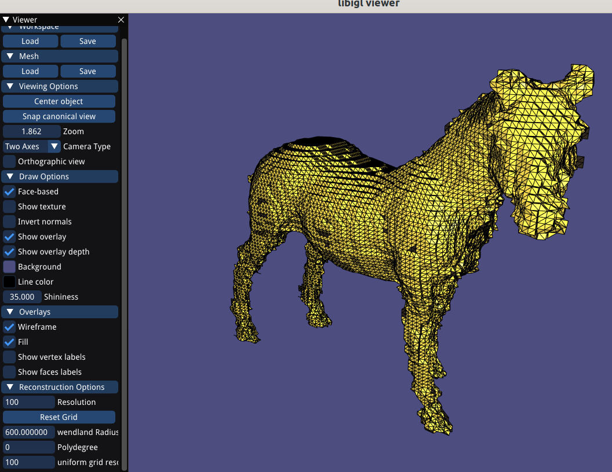

# Assignment 2

Edit this 'README.md' file to report all your results. There is no need to write lengthy reports, just show the requested outputs and screenshots and quickly summarize your observations. Please add your additional files or notes in the folder 'assignment2/results' and refer to or directly show them in this page.

## Required results

### Coding Tasks
1) Show the visualization of the constrained points for the 'cat.off' point cloud.

 

2) Show screenshots of the (non-axis-aligned) grid with nodes colored according to their implicit function values (cat.off and luigi.off).

Haven't done that.

3) Show screenshots of the reconstructed surfaces. Experiment with different parameter settings: grid resolution (also anisotropic in the 3 axes), Wendland function radius, polynomial degree. Add all these settings to the GUI to ease experimentation. Briefly summarize your observations and save the reconstructed models in the off format for every point-cloud dataset provided (assignment2/results).

In general Higher polynomial degree imposes some artifacts on the surface of the objects in form of little spikes. 

More screenshots in /result

4) Show the computation time using the spatial index VS. using the brute-force loop.

Computation time of spatial index (uniform grid, 50^3 grid size) vs brute-force for loop: ~24000ms vs ~7170000ms (Hound)

### Additonal Tasks: 

(1) and (2) Save your notes (pdf or png) and add a link to this page.

[link to note1](https://github.com/eth-igl/gp21-trinhhe/tree/master/assignment2/results)

(3) Show screenshots comparing the 'hound.off' of the normal based reconstruction to the point based reconstruction of the mandatory task.

(4) Show screenshots comparing your MLS reconstruction results to the surfaces obtained with Screened Poisson Reconstruction and RIMLS, and explain their main differences to your MLS. Report your findings.

(5) Show screenshots comparing the PCA normals and the provided normals on the 'luigi.off' model. Report your findings.