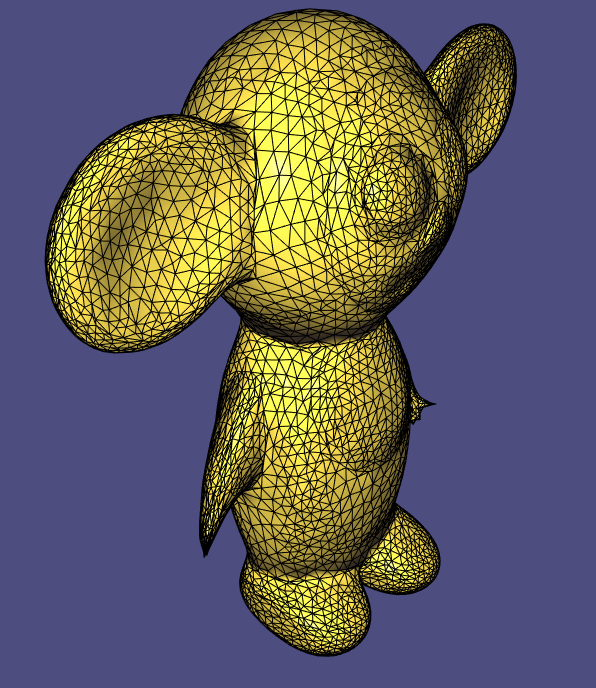

# Assignment 3

Edit this 'README.md' file to report all your results. There is no need to write lengthy reports, just show the requested outputs and screenshots and quickly summarize your observations. Please add your additional files or notes in the folder 'assignment3 /results' and refer to or directly show them in this page.

## Required results

### Mandatory Tasks
1) Show the screenshots of 2 (non-noisy) meshes of your choice from the data folder shaded with the 5 different normals. For the PCA normals show them with k=3 and k=6, for the quadratic fitted normals show them each with two different values for k (make sure you have at least 5 points when fitting the quadratic bivariate polynomial).

k means for PCA and quad fit that we consinder for a vertex only the k nearest nodes by bfs through edges (not euclidean distance).

#### Bumpy Cubes
[std vertex normals](results/cubes/cube_std_normals.png)

[area weighted normals](results/cubes/cube_area_normals.png)

[mean-curvature normals](results/cubes/cube_mean_normals.png)

[pca normals, k=3](results/cubes/cube_pca_3.png)

[pca normals, k=6](results/cubes/cube_pca_6.png)

[quad fit normals, k=20](results/cubes/cube_quad_20.png) 

#### Lion
[std vertex normals](results/lions/lion_std_normals.png)

[area weighted normals](results/lions/lion_area_normals.png)

[mean-curvature normals](results/lions/lion_mean_normals.png)

[pca normals, k=3](results/lions/lion_pca_3.png)

[pca normals, k=6](results/lions/lion_pca_6.png)

[quad fit normals, k=10](results/lions/lion_quad_10.png) 

[quad fit normals, k=20](results/lions/lion_quad_20.png) 

--------------------------------------------------------
2) Report your matching between curvature expressions and the figures. Provide a short motivation for your matchings.

Figure c belongs to K2 since left swirl turns counter-clock wise and after passing value 0 we have a swirl turning clock wise.

Figure b belongs to K4, because for |s| < 2 we have negative values and we see the curve changing its turning direction and spinning ~2 times before changing into the original turning direction.

Figure a belongs to K3, because K3 gets to 0 for infinitely small s, therefore the curvature around -0.5:0.5 is rather straight than curvy.

Figure d belongs to K1, for small s the curve still has curvature of 1.

-----------------------------------------------------------
3) Show screenshots of 1 (non-noisy) mesh of your choice from the data folder coloured according to the 4 discrete curvature measures.

#### Discrete Mean Curvature

#### Discrete Gaussian Curvature

#### Discrete Kmin Curvature

#### Discrete Kmax Curvature

------------------------------------

4) Report your findings on the differences between implicit and explicit Laplacian smoothing, the differences between uniform vs cotangent weights and report the parameters you used and how changing them affects the result. Also show screenshots of both the implicit and explicit Laplacian smoothing results for 1 mesh from the data folder.

For the explicit case when our delta is too big, the unstability comes in the form of huge artifact spikes. 

I've used the Voronoi area for this mesh.

#### Original Cheburashka

#### Explicit smoothing with h = 0.000001, 300 iterations and cotangent weights

#### Implicit smoothing with h = 0.001, 1 iterations and cotangent weights

Looking at the difference between the weights. We see for uniform weights that at the boundaries or where ever the surface rises a bit (e.g the eyes) the meshes are closer to each other in comparison to cotangent weights.

#### implicit smoothing with h = 0.001, 2 iterations and uniform weights

#### implicit smoothing with h = 0.001, 2 iterations and cotangent weights

5) Report your findings on the comparison with results you obtained with the Laplacian smoothing vs with bilateral smoothing. Show screenshots of bilateral smoothing applied to 1 **noisy** mesh from the data folder.

#### Bunny Original

#### Bunny with implicit Laplacian

#### Bunny with bilateral

