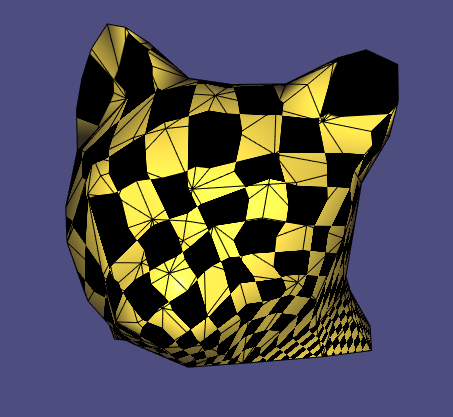

# Assignment 4

Edit this 'README.md' file to report all your results. There is no need to write lengthy reports, just show the requested outputs and screenshots and quickly summarize your observations. Please add your additional files or notes in the folder 'assignment4/results' and refer to or directly show them in this page.

## Required results

* Screenshots of the parameterizations and textured (checkerboard) models for all the implemented methods and boundary conditions (models: cathead.obj, hemisphere.off, hemisphere_non_convex_boundary.off,Octo_cut2.obj)
* Several examples of the distortion visualizations.

For the free boundary condtion, I took the first vertex and the "middle" vertex from igl::boundary_loop. Since the edges in the boundary loop don't differ in length that much, they make an good approximation for the most distance vertices.

#### Cathead
Uniform Laplacian\

Cotangent Laplacian

LSCM free boundary

LSCM fix boundary

Uniform Laplacian UV

Cotangent Laplacian UV

LSCM free boundary UV

LSCM fix boundary UV

#### Hemisphere
Uniform Laplacian\

Cotangent Laplacian

LSCM free boundary

LSCM fix boundary

Uniform Laplacian UV

Cotangent Laplacian UV

LSCM free boundary UV

LSCM fix boundary UV

#### Hemisphere Non Convex Boundary
Uniform Laplacian\

Cotangent Laplacian

LSCM free boundary

Uniform Laplacian UV

Cotangent Laplacian UV

LSCM free boundary UV

#### Octo
Uniform Laplacian\

Cotangent Laplacian

LSCM free boundary

LSCM fix boundary

Uniform Laplacian UV

Cotangent Laplacian UV

LSCM free boundary UV

LSCM fix boundary UV

ARAP distortion doesn't seem to work...\
Haven't visualize the distortion...
