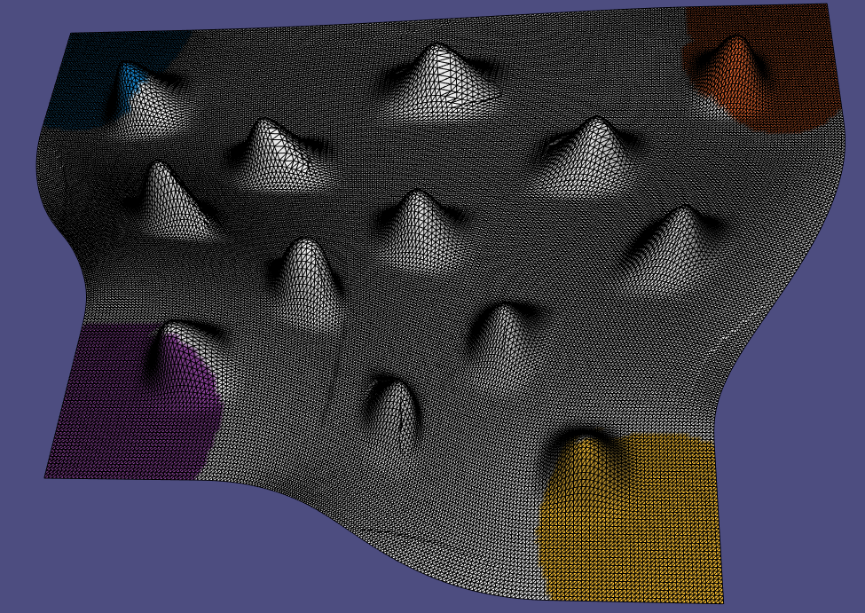

# Assignment 5

Edit this 'README.md' file to report all your results. There is no need to write lengthy reports, just show the requested outputs and screenshots and quickly summarize your observations. Please add your additional files or notes in the folder 'assignment5/results' and refer to or directly show them in this page.

## Required results for assignment 5

### Multiresolution Mesh Editing

Provide screenshots for 4 different deformed meshes. For each example, provide a rendering of S, B, B' and S'.

### Deformation transfer

Discuss and show the differences to the results obtained with the high-frequency detail transfer from part 1.4.

