# Shape Modeling and Geometry Processing - Final Project

## Members (Team 8)

|Name           |Email                      |
|---------------|---------------------------|
|Nuno Dantas    |dnuno@student.ethz.ch      |
|Julian Dunskus |jdunskus@student.ethz.ch   |
|Marko Nikic    |marko.nikic@inf.ethz.ch    |
|Henry Trinh    |trinhhe@student.ethz.ch    |
|Mengqi Wang    |mewang@student.ethz.ch     |
|Laura Wülfroth |laura.wuelfroth@inf.ethz.ch|

## Work Partition

Mengqi Wang

* Presentation, coordination etc.
* (Bonus) Personalized 3D faces

Henry Trinth, (Marko Nikic)

* 3D keypoint selection

Julian Dunskus

* Rigid registration (ICP)

Marko Nikic, (Laura Wülfroth)

* Non-rigid registration

Laura Wülfroth

* (Bonus) Learning based face space

Nuno Dantas

* PCA space interpolation and visualization

# Documentation

## Setup

### Compiling and running the program

* `mkdir build`
* `cd build`
* `cmake -DCMAKE_BUILD_TYPE=Release ../`
* `make`
* `./gp21-project`

### Data Layout

* `data/faces_raw`: Contains the scanned faces and the templates
* `data/faces_rigid`: Contains the rigidly aligned faces
* `data/faces_warped`: Contains the warped face templates warped to their respective face
* `data/landmarks`: Contains the landmarks for each scanned face and the templates

### Preconditions

Before starting the preprocessing pipeline (landmark selection + rigid alignment + non-rigid warping), select one of the three available face template files inside `main.cpp` and make sure the landmarks of that template exist inside `data/landmarks`.

## Preprocessing

* You can select a face from the drop-down menu
* You can optionally display/hide the landmarks
* You can choose whether to display the scanned face (with red/blue landmarks) or the template face (with green landmarks)

### Landmark Selection

* Press (S) or select the `SELECT` mode from the `Mouse Mode` dropdown menu in order to click on the face to select vertices.
* Click on points on the face where you want your landmarks. These are displayed in blue and can be reset via the `Discard selection` button. If you are happy with your current selection click `Apply selection` to commit the current selection.
* You can now repeat that process over again to add further landmarks.
* Make sure you specify the landmarks in the same order as for the template mesh, so that landmarks with the same number are placed on the same key points.
* Once you're done, click `Save landmarks` to write the red landmarks to a file.

|Scanned Face|Template with landmarks|
|---------|--------|
|  | 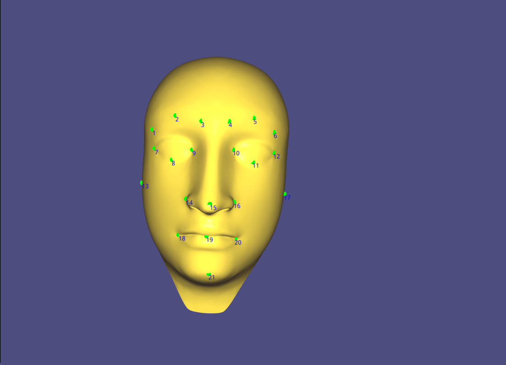 |

|Select Landmarks|Apply Selection and repeat|
|---------|--------|
| 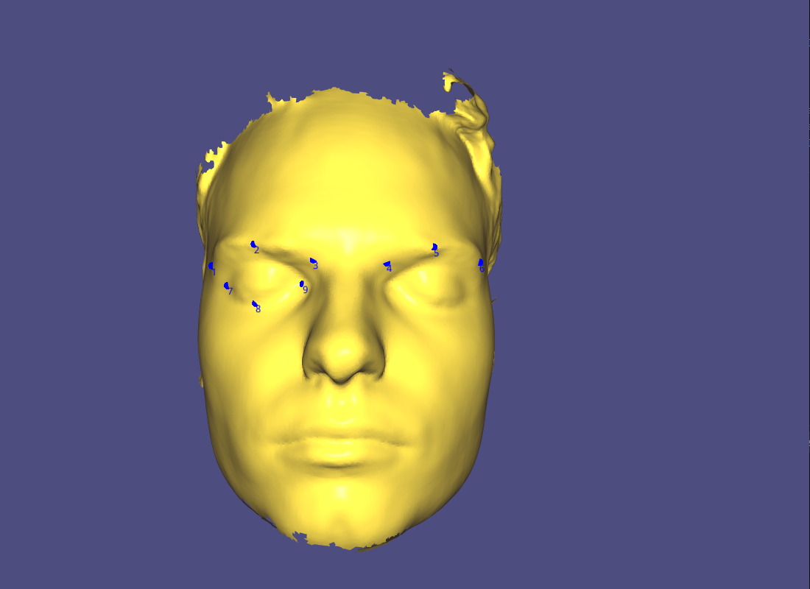 | 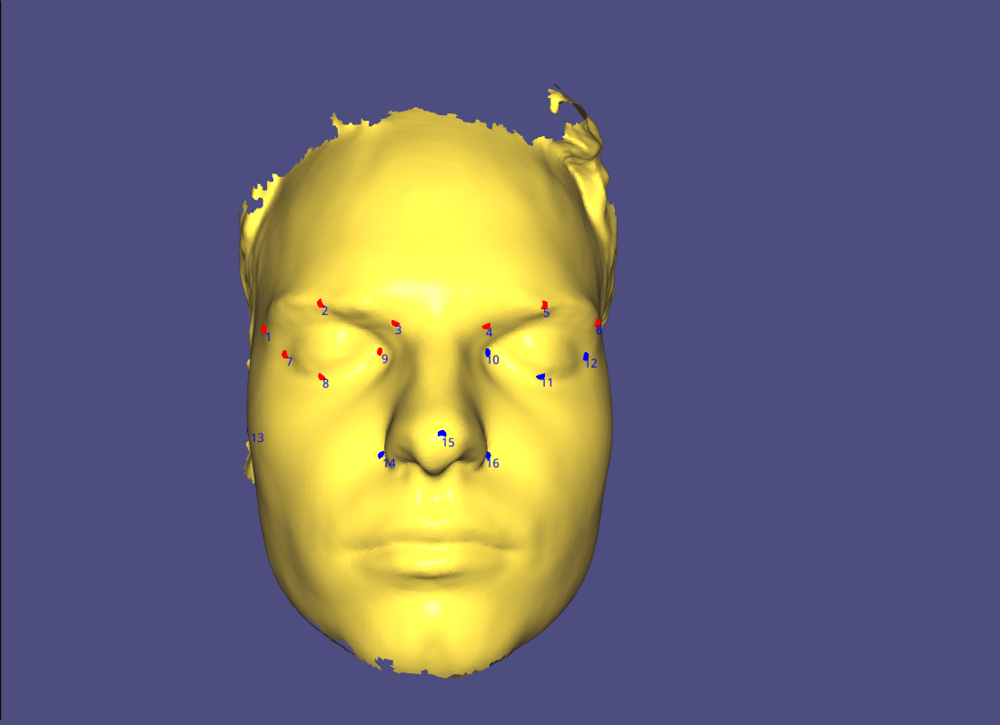 |

### Rigid Alignment

* Once you have matching landmark correspondences of the scanned face and the template, you can click on `Rigidly align` in order to rigidly align the template to the scanned face. 

|Overlayed|Face only|Template only|
|---------|--------|--------|
| 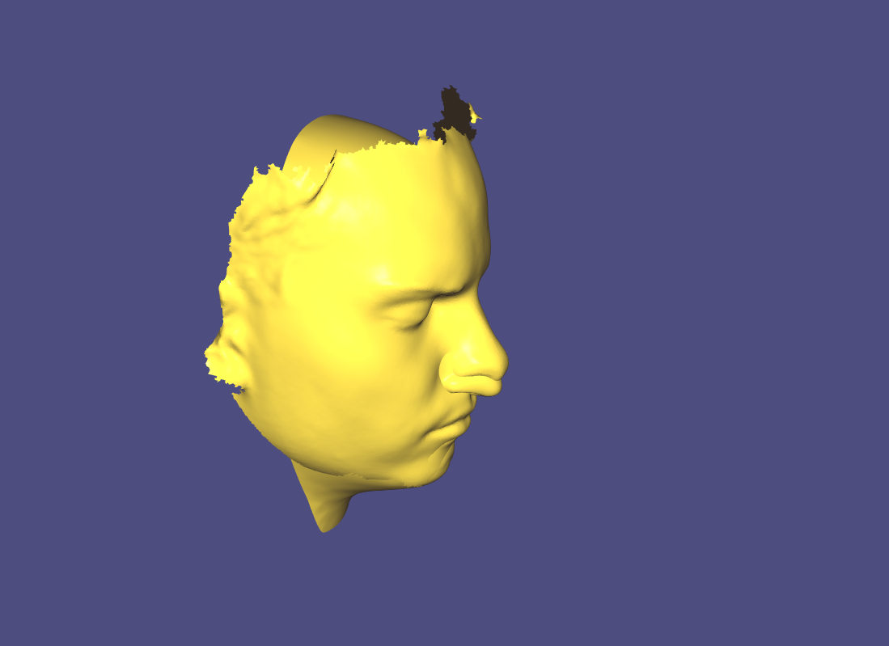 | 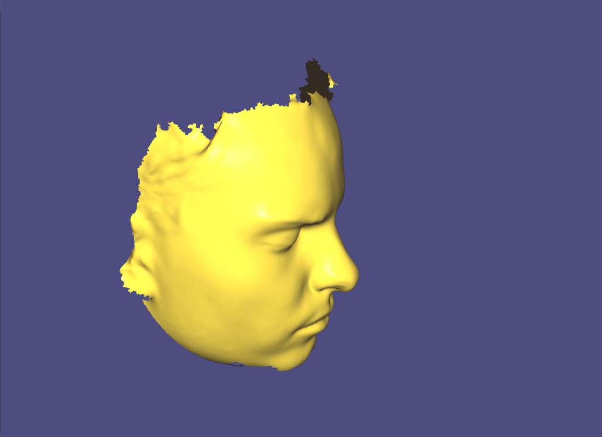 | 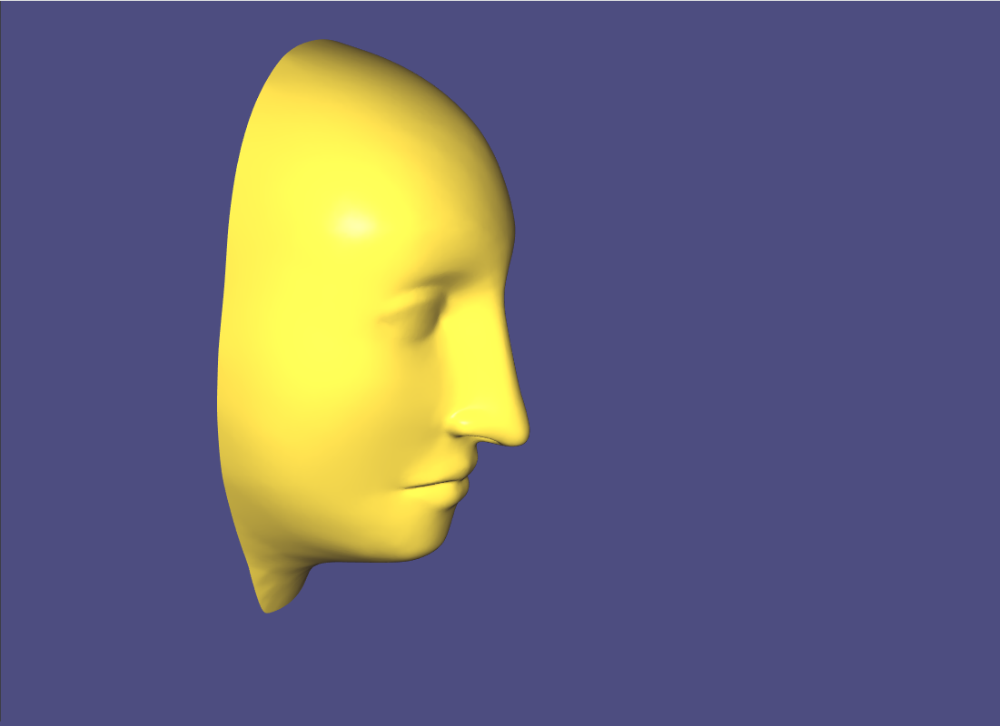 |

### Non-Rigid Warping

Given a rigidly-aligned template and a scanned face, both with landmark correspondences, we now warp the template onto the target mesh by solving a minimization problem. We want to find deformed vertex positions `x'` such that the laplacian energy subject to constraints `||Lx' - Lx||² + λ(Cx' - d)` is minimized. The constraints are constructed using the following strategy:

* Map template landmarks to corresponding target landmark positions.
* Keep the template boundary vertices fixed.
* Choose target mesh vertices as constraints using the strategy described below.

For each template vertex `v_temp`, we look up its closest target mesh vertex `v_target` with respect to euclidean distance. (This process is accelerated with a spatial index since the template and target mesh are not topologically connected.) If some closest vertex `v_target` is found and it is within a threshold then this vertex becomes the constraint position of the template vertex `v_temp`.

We avoid attaching multiple template vertices to the same target vertex in order to avoid collapsing multiple vertices to the same position, and we avoid using the target mesh boundary vertices as constraints. The threshold for closest target vertices is increased iteratively. We say that our scheme has converged once an iteration does not add any new constraints.

Once the constraints have been built, we use the row/col removal trick from the past assignments to solve the minimization problem subject to the constraints.

* Once the template is rigidly aligned to the scanned face, you can click on the `Warp` button to perform one iteration of non-rigid warping. Keep clicking the button until convergence.

|Template|After 1 iteration|
|---------|--------|
| 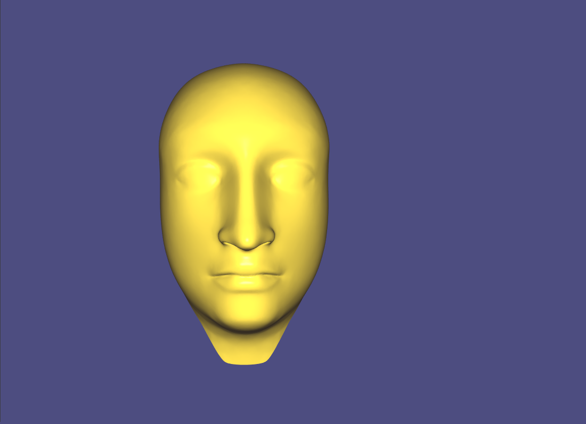 | 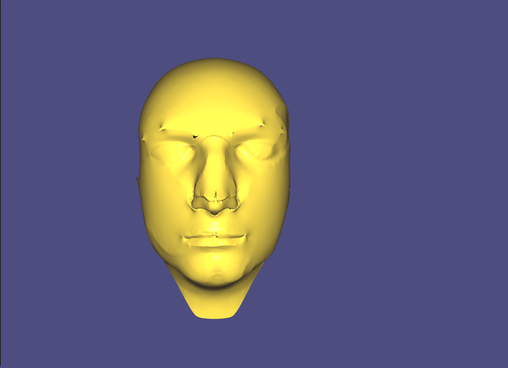 |

|After 4 iterations|Converged|
|---------|--------|
| 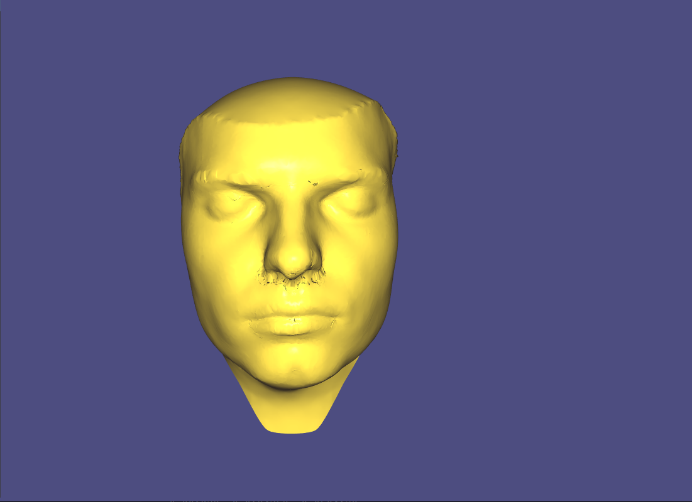 | 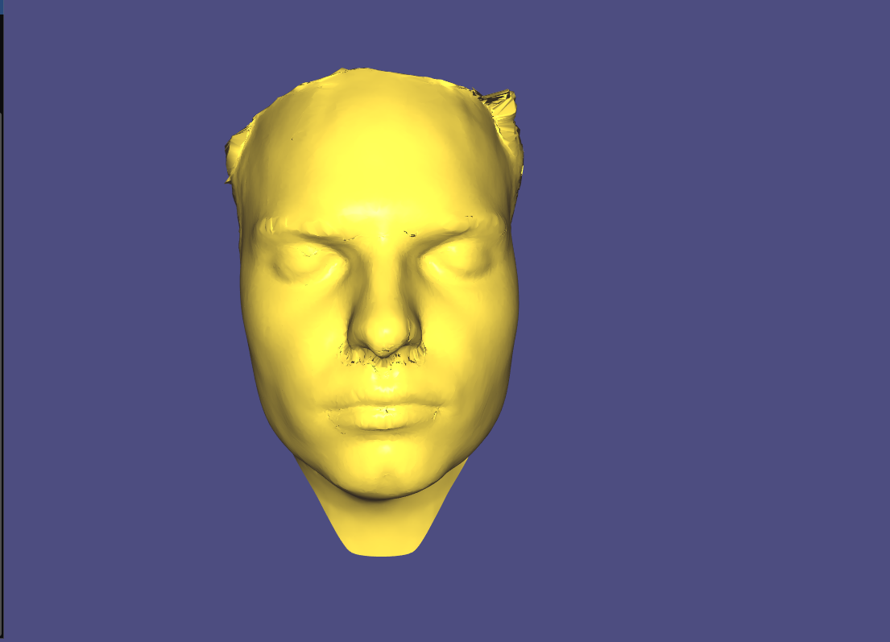 |

## PCA and Face Morphing

When entering PCA Mode, you will need to specify a target folder that should contain meshes to use for the eigenface decomposition.
These meshes should have the same amount of vertices and the same triangle layout.

After the folder has been selected, simply launch the decomposition with `Build Eigenfaces`.

When it has finished, there will be two new options: `Display Normal` and `Display Morph`.

### Display Normal  
This mode allows the user to display a face from the given inputs by using the eigenface reconstruction.
The reconstruction is computed as follows : `new_mesh = average_mesh + eigen_vectors * weights`.

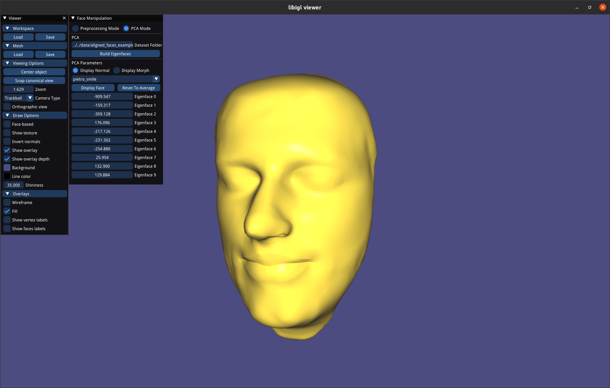

### Display Morph  
This mode allows the user to display a linear combination of two meshes. The user can simply select the two target meshes via the drop-down menus (or click the arrows).
Then, by changing the `Morphing Coefficient`, the user can specify how the resulting mesh should look.
There is also an option to animate this morphing, by pressing the `Animate Morphing` button.
Here are some examples of the morphing animation:


## Bonus

### Learning-Based Face Space
Our Convolutional Mesh Autoencoder is located in the ModelPytorch folder and completely implemented in Python. To be able to run the code a virtual environment with Python 3.8 is needed with the following libraries:

* numpy
* scipy
* pytorch (with the correct cuda version)
* torch-geometric
* tensorboard
* libigl
* meshplot

##### Face Morphing
Face morphing using a trained model is explained in the jupyter notebook FaceMorphing. To run the jupyter notebook the virtual environment needs to be added as a kernel see for explanation: [Add Virtual Environment to Jupyter Notebook](https://janakiev.com/blog/jupyter-virtual-envs/)

Here is an example using our trained model:

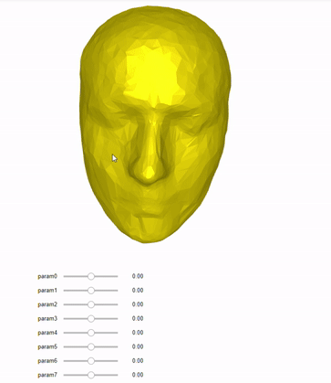

##### Training
To train the model the user can simply run the following line:
```
python train.py --train_set ../data/train/ --epochs 100 --learningrate 5e-4 --encoder_ckpt encoder.pth --decoder_ckpt decoder.pth
```

### Personalized 3D Faces
We also obtained our own 3D faces using existing mobile app called Capture. Silmilar to the meshes in `../data/faces_raw` folder, we scanned different facial expressions including smile, neutral and sad face. Once the point clouds from the mobile app are exported, we cleaned up and removed hair and neck parts in MeshLab. Then the surface meshes are constructed using Screened Poisson method. 
